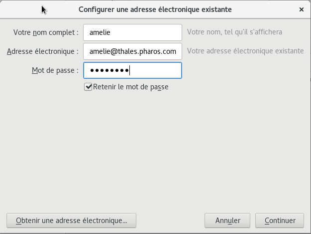
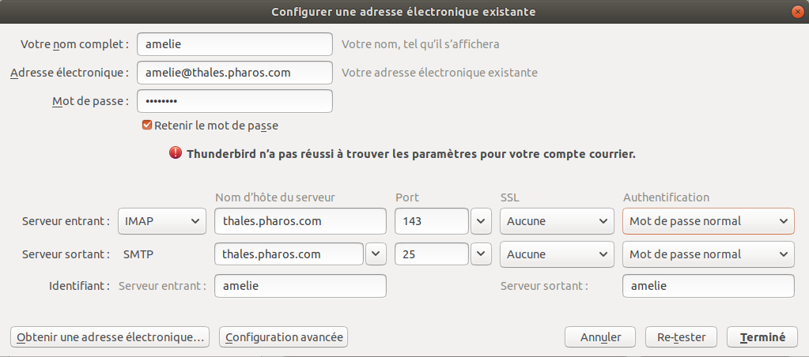
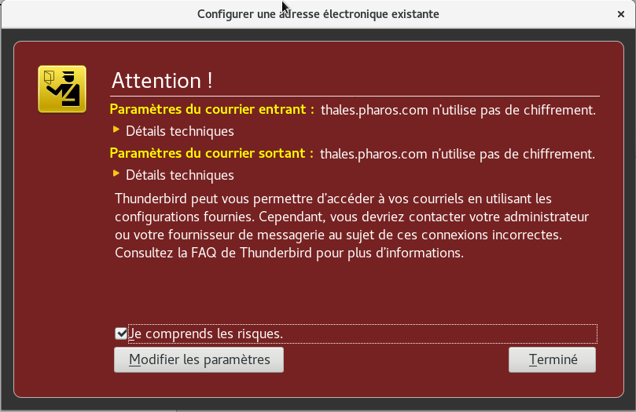
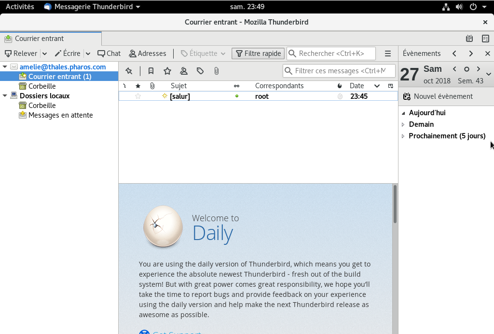

## Set up a SMTP server - Send and receive an email (Debian)

### Summary
1. Install and configure postfix, dovecot and mailutils (**Server**)
2. Send and receive an email on the same computer with mailutils (**Server -> Server**)
3. Create an user (email account)  (**Server**)
4. Send and receive an email through Java from a client to the server machine  (**Client -> Server**) 
5. Send and receive an email through Thunderbird from a client to the server (**Client <-> Client**) 
6. Gitlab / Jenkins / SonarQube

### Install et configure postfix, dovecot and mailutils  (Server side)
Sources :  
**Youtube** : [**link**](https://www.youtube.com/watch?v=Jeod07TdYkc)  
**ConfigPosfixFr**: [**link**](https://postfix.traduc.org/index.php/BASIC_CONFIGURATION_README.html)    
All the commands are performed in root.
1. Get the machine IP address :

    ```bash
    $ lsb_release -a ; getconf LONG_BIT ; hostname -I
    ```
2. Define a hostname (for instance : my.domain.com) :
    ```bash
    $ hostnamectl set-hostname my.domain.co
    ```
3. Modify the `/etc/hosts` :
    Add the following line and reboot the machine :
    ```bash
    IP_SERVER_MACHINE my.domain.co
    ```
4. Install the following packages :
    ```bash
    $ apt -y install postfix sasl2-bin dovecot-core dovecot-pop3d dovecot-imapd mailutils
    ```
    Choose: `No configuration` for postfix.  
    **Postfix** : Send emails though SMTP;  
    **Sasl2** : Security Layer- **S**imple **A**uthentication and **S**ecurity **L**ayer;  
    **Dovecot** : Receive emails through IMAP or POP protocole;  
    **Mailutils** : Send email in command line.  
5. Copy the postfix config file from `/usr/share/postfix/` to `/etc/postfix` and edit it:
    ```bash
    $ cp /usr/share/postfix/main.cf.dist /etc/postfix/main.cf
    $ vi /etc/postfix/main.cf
    ```
    Modify the following lines (*line numbers might change depending on the version*) :
    ```bash
    78      mail_owner = postfix
    94      myhostname = YOUR_COMPLETE_DOMAIN # my.domain.com
    102     mydomain = YOUR_DOMAIN # domain.com
    123     myorigin = $mydomain
    137     inet_interfaces = all
    185     mydestination = $myhostname, localhost.$mydomain, localhost, $mydomain
    228     local_recipient_maps = unix:passwd.byname $alias_maps
    270     mynetworks_style = subnet
    287     mynetworks = 127.0.0.0/8, YOUR_NETWORK_ADDRESS/24
    407     alias_maps = hash:/etc/aliases
    418     alias_database = hash:/etc/aliases
    440     home_mailbox = Maildir/
    576     #smtpd_banner = $myhostname ESMTP $mail_name (Ubuntu)
    577     smtpd_banner = $myhostname ESMTP 
    650     sendmail_path = /usr/sbin/postfix
    655     newaliases_path = /usr/bin/newaliases
    660     mailq_path = /usr/bin/mailq
    666     setgid_group = postdrop
    670     #html_directory =
    674     #manpage_directory =
    679     #sample_directory =
    683     #readme_directory =
    ```
    
6. Add also at the end of the file :
    ```bash
    message_size_limit = 10485760
    mailbox_size_limit = 1073741824
    # SMTP-Auth setting
    smtpd_sasl_type = dovecot
    smtpd_sasl_path = private/auth
    smtpd_sasl_auth_enable = yes
    smtpd_sasl_security_options = noanonymous
    smtpd_sasl_local_domain = $myhostname
    smtpd_recipient_restrictions = permit_mynetworks,permit_auth_destination,permit_sasl_authenticated,reject
    ```
7. Enter the `newaliases` command to initialize the alias database for postfix (*see man newaliases*) :
    ```bash
    $ newaliases
    ```
8. Edit the file `/etc/dovecot/dovecot.conf` :
    Modify the line :
    ```bash
    30      listen = *, ::
    ```
9. Edit the file `/etc/dovecot/conf.d/10-auth.conf` :   
    Modify the line :
    ```bash
    10      disable_plaintext_auth = no
    100     auth_mechanisms = plain login
    ```  
10. Edit the filer `/etc/dovecot/conf.d/10-mail.conf` : 
    Modify the line :
    ```bash
    30      mail_location = maildir:~/Maildir
    ```
10. Edit the filer `/etc/dovecot/conf.d/10-master.conf` : 
    Modify the lines :
    ```bash
    96        unix_listener /var/spool/postfix/private/auth {
    97          mode = 0666
    98          user = postfix
    99          group = postfix
    100       }
    ```
11. Reboot the postfix and dovecot services :
    ```bash
    $ systemctl restart dovecot postfix ; systemctl status dovecot postfix
    ```
12. Create and edit the file `/etc/profile.d/mail.sh` then reboot :    
    ```bash
    $ echo 'export MAIL=$HOME/Maildir/' >> /etc/profile.d/mail.sh
    $ reboot
    ```
    
### Send and receive an email on the same computer with mailutils (**Server -> Server**)
1.  Get the your username. You can get it by opening a console and note what is before the `@`:  

    ```bash
    YOUR_NAME@smtpserver:~$
    ```

2.  Don't forget to be in root user.  
    Below, we'll send an email from `YOUR_NAME@my.domain.com` from `root@my.domain.com`
    ```shell
    $ mail YOUR_NAME@my.domain.com
    Cc :
    Subject : Test mail
    Content test
    ```
    Do a carriage return then `Crtl+D` to send the email.
    You'll find it in `/home/USERNAME/Maildir/new`.  

### Create an user (email account)
1. Let's create a new user called amelie :  

    ```bash
    $ useradd -m -G mail -s /bin/bash amelie
    ```
2. Set a pawword and **reboot postfix and dovecot** :
    ```bash
    $ passwd amelie
    $ systemctl restart dovecot postfix
    ```

### Send and receive an email through Java from a client to the server machine  (**Client -> Server**) 
Be sure to have **maven** and **java**  
```bash
$ apt install maven
$ apt install default-jdk
```
The client and the server must be on the same network.

1. Modify the file `/etc/hosts` to add the server ip address :

    ```bash
    $ vi /etc/hosts
    ```
   Add :
    ```bash
    IP_SERVEUR_MACHINE my.domain.com
    ``` 
2. Create a spring https://start.spring.io (or maven project depending on your goal)
3. Add the library javax mail to your `pom.xml` :

    ```xml
    <!-- https://mvnrepository.com/artifact/com.sun.mail/javax.mail -->
    <dependency>
        <groupId>com.sun.mail</groupId>
        <artifactId>javax.mail</artifactId>
        <version>1.6.2</version>
    </dependency>
    ```
4. Code from (Source : [lien](https://www.tutorialspoint.com/javamail_api/javamail_api_sending_simple_email.htm))  

    ```java
    import org.springframework.boot.SpringApplication;
    import org.springframework.boot.autoconfigure.SpringBootApplication;

    import java.util.Properties;

    import javax.mail.Message;
    import javax.mail.MessagingException;
    import javax.mail.PasswordAuthentication;
    import javax.mail.Session;
    import javax.mail.Transport;
    import javax.mail.internet.InternetAddress;
    import javax.mail.internet.MimeMessage;

    @SpringBootApplication
    public class DemoApplication {
       public static void main(String[] args) {
          // Recipient's email ID needs to be mentioned.
          String to = "USERNAME@my.domain.com";
    
          // Sender's email ID needs to be mentioned
          String from = "amelie@my.domain.com";
          final String username = "amelie";//change accordingly
          final String password = "password";//change accordingly
    
          // Assuming you are sending email through relay.jangosmtp.net
          String host = "my.domain.com";
    
          Properties props = new Properties();
          props.put("mail.smtp.auth", "true");
          props.put("mail.smtp.starttls.enable", "true");
          props.put("mail.smtp.host", host);
          props.put("mail.smtp.port", "25");
    
          // Get the Session object.
          Session session = Session.getInstance(props,
             new javax.mail.Authenticator() {
                protected PasswordAuthentication getPasswordAuthentication() {
                   return new PasswordAuthentication(username, password);
           }
             });
    
          try {
           // Create a default MimeMessage object.
           Message message = new MimeMessage(session);
        
           // Set From: header field of the header.
           message.setFrom(new InternetAddress(from));
        
           // Set To: header field of the header.
           message.setRecipients(Message.RecipientType.TO,
                   InternetAddress.parse(to));
        
           // Set Subject: header field
           message.setSubject("Testing Subject");
        
           // Now set the actual message
           message.setText("Hello, this is sample for to check send " +
            "email using JavaMailAPI ");
    
           // Send message
           Transport.send(message);
    
           System.out.println("Sent message successfully....");
    
          } catch (MessagingException e) {
             throw new RuntimeException(e);
          }
       }
    }
    ```
5. Start the project :
    ```bash
    $ mvn spring-boot:run
    ```
    The mail is in (server) `/home/usermane/Maildir/new`. 

### Send and receive an email through Thunderbird from a client to the client (**Client <-> Client**) 
Install **thunderbird**
```bash
$ apt-get install thunderbird thunderbird-l10n-fr
```

1. Add a new emai account.  
  
Check your `/etc/hosts` :
    ```bash
    IP_SERVEUR_MACHINE my.domain.com
    ```
    
2. **Note** : You may encounter an error page saying that Thunderbird failed to find the correct settings for your email account 
(usually with Ubuntu), use the following settings if so :  


3. Because there were no encryption during the postif installation you'll see the message :  
  

4. Do the same on a other client machine a send a email  


### Gitlab / Jenkins / Sonarqube

Gitlab, Jenkins and SonarQube can send email with their own postfix.

#### Gitlab

In Gitlab simply add in the /etc/postfix/main.cf :

```bash
relayhost = IP_SERVEUR_SMTP
```

#### Jenkins

1. Modify the file `/etc/hosts` :

    ```bash
    IP_SERVEUR_MACHINE my.domain.com
    ```
    
##### Email with no attachment

2. Go in **Manage Jenkins** -> **Configure System**, then in **E-mail Notification** :  

    **SMTP server :** IP_SERVER_MACHINE
    **Default user e-mail suffix :** @my.domain.com
    **Use SMTP Authentication :** checked  
    **User Name :** some username in the server  
    **Password :** your password  
    **Use SSL :** not checked
    **SMTP Port :** 25  
    **Reply-To Address :** leave empty
    **Charset :** UTF-8  

##### Email with no attachment

1. Install the plugin `Email extension plugin`
2. Go in **Manage Jenkins** -> **Configure System**, then in **Extended E-mail Notification** complete with the same info as **E-mail Notification**
3. In a Jenkins job add a **Post-build Action** - **Editable Email Notification**
4. Go in **Advanced Settings**, in **Trigger** clic on **Add Trigger** and choose you favorite trigger.
5. In **Send To**, choose **Recipient List** then clic on **Advanced** and fill as follow :  
   **Recipient List :** username@my.domain.com etc...  
   **Attachements :** path/to/the/file  
**The file must be inside the Jenkins jobs folder**

#### SonarQube

1. Log in sonarqube with you admin account and go in **Administration**, **Configuration**, **General**
2. Add the smtp host : IP_SERVER_MACHINE
3. Leave the other fields.


