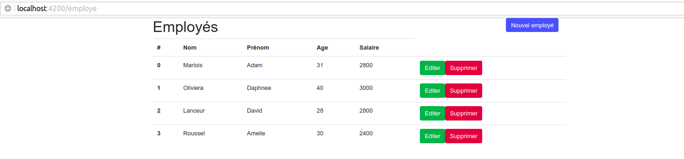
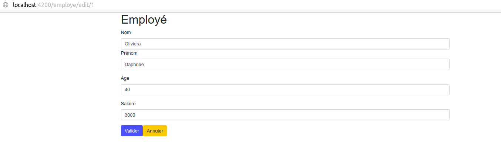

# Create a simple CRUD with Spring and Angular

(The following CRUD was based on an other online tutorial)

## Test the project

1. Open a console an go in **back-end** :

    ```bash
    $ mvn spring-boot:run
    ```

2. Open another console an go in **front-end** :

   ```bash
   $ npm install
   $ ng serve
   ```
   
3. Open a browser and go on **http://localhost:4200**
You should get something like :
  



## Deploy the project

1. Open another console an go in **front-end** :

   ```bash
   $ npm install # if not done 
   $ ng build    # you can do a --prod depending on you goal
   ```
   
2. Go in **back-end** and compile the back and the front in one jar.

   ```bash
   $ mvn -P bundle clean package
   ```
3. The jar is in **back-end/target**

4. Launch it and go to **http://localhost:8080**
